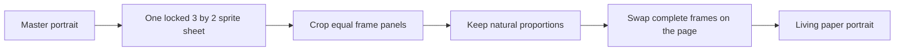

Making a paper portrait feel alive was not mainly an animation problem. It was a **continuity** problem. The version that finally worked is a small flipbook: a few fully composed frames, generated together in one locked sprite sheet, swapped at deliberate moments. That gave me a blink and a plant sway without turning the portrait into a flickering video effect.

The important choices were simple: keep one master composition, avoid live image fragments, use a shared sprite sheet instead of separately generated frames, and test every frame at the exact crop used on the site. The result is intentionally quiet. It should feel like a drawing briefly remembering that it is alive.

## The brief: a talking painting, but made of paper

I have been slightly obsessed with the moving portraits in *Harry Potter* for a long time. I wanted my landing page portrait to carry a little of that same feeling: not a big cinematic animation, but a person drawn on paper who occasionally blinks while the plant beside him catches a small breeze.

That brief created a constraint that was easy to miss at first. The page already has a hand-drawn, taped-to-paper visual language. Any motion had to belong to that world. Smoothness was not the goal; **believability inside a static illustration** was.

## Why I did not use image-to-video or a GIF

Image-to-video is built to invent movement between moments. That is useful for a cinematic clip, but it is the wrong trade for a framed illustration. It can introduce camera drift, altered features, new textures, and motion that does not respect the original drawing. I wanted control over each visible state, not a plausible interpretation of what might happen next.

GIF is not really an alternative approach here; it is only a file format for delivering a sequence. A GIF made from unstable source frames would still jump. It would also make timing and accessibility less flexible than a small set of ordinary images controlled by the page.

The first approach we tried was live partial movement: place generated eye, plant, and hand fragments over the original image. It looked promising in isolation, but it broke in motion. The generated fragments subtly changed surrounding pixels, linework, and paper texture. The result was a seam or a flicker exactly where the illusion needed to be calm.

## The useful lesson from the Codex-pet style of animation

The inspiration I took from the Codex-pet approach was not a specific asset format. It was the idea that a character can feel alive through a small number of purposeful, recognisable states. A blink is not a continuous simulation of eyelids; it is a sequence of carefully chosen drawings. The same is true of a leaf leaning left and then right.

That also aligns with a durable lesson from drawn animation: each drawing has to remain registered to the same character, pose, and world. If the head, chair, paper, or camera changes even slightly, the viewer notices the mechanics instead of the magic.

## The turning point: one locked sprite sheet

Separately generated frames did not hold their composition closely enough. Even when every file had the same dimensions, the person inside the image could shift a few pixels. We corrected horizontal movement, then noticed vertical movement. That was the wrong battle: the artwork itself was changing.

The breakthrough was asking for a **single six-panel sprite sheet**. Instead of asking a generator to recreate the portrait six times, we asked for one shared canvas with six equal panels and an explicit rule: everything must remain fixed except the blink and the plant.

The sequence is deliberately small:

1. Still portrait.
2. Plant leaning slightly left.
3. Still portrait again.
4. Eyes closed for a quick blink.
5. Plant leaning slightly right.
6. Still portrait again.

By making those panels part of one generated composition, their camera position, chair, colour treatment, and brushwork became far more consistent. We then cropped every panel to the same site framing and played the relevant frames as a flipbook.

## The blockers were visual, not only technical

The hardest part was learning to take small visual problems seriously.

- A red tape strip at the top of the frame flickered during swaps. The portrait frames were painting over it, so the fix was to keep the tape permanently above the animation.
- A frame that looked fine alone could still slide when compared with the previous frame. Matching canvas dimensions was not enough; the content inside the canvas had to be aligned too.
- A crop can silently distort an illustration. We briefly stretched the sprite panels to fit the portrait slot, then rebuilt them at their natural proportions and adjusted the crop instead.
- More movement was not always better. A single isolated blink looked like an error. A restrained rhythm—long pauses, an occasional short blink, and a plant movement—read more naturally.

The final page also respects `prefers-reduced-motion`, so the portrait remains still for people who ask their device to minimise animation.

## The skill: Animated Portrait Flipbook

I turned this workflow into [Animated Portrait Flipbook](https://github.com/gksoriginals/animated-portrait-flipbook), a reusable coding-agent skill. Its job is not “make an image move.” Its job is to preserve a visual world while adding just enough motion to suggest a character.

The operating rules are now encoded in the skill: begin from one master composition, prefer a locked sprite sheet, swap full frames rather than live fragments, keep page decorations outside the animated stack, preserve aspect ratio, validate at the final crop, and publish only after watching a full loop.

That is the bit I wanted to keep. The portrait is a small piece of magic; [the skill](https://github.com/gksoriginals/animated-portrait-flipbook) is the recipe for making that magic hold together.
